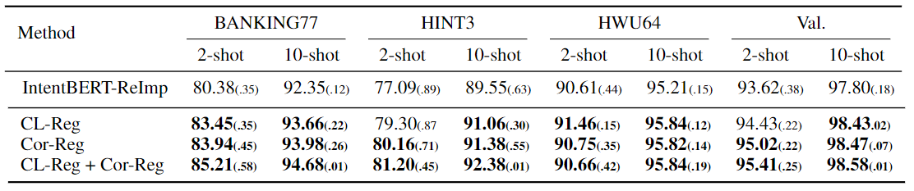
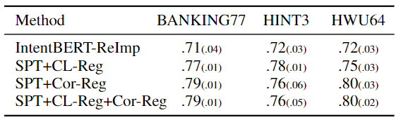

## Fine-tuning Pre-trained Language Models for Few-shot Intent Detection: Supervised Pre-training and Isotropization

This repository contains the code of the paper on NAACL 2022: [Fine-tuning Pre-trained Language Models for Few-shot Intent Detection: Supervised Pre-training and Isotropization]().

## Quick Links

  - [Overview](#overview)
  - [Reproduce](#reproduce)
    - [Data](#data)
    - [Environment](#environment)
    - [Scripts](#scripts)
    - [How](#how)
    - [Models](#models)
  - [Citation](#citation)

## Overview

Training a well-performing intent classifier with limited annotations is challenging. Recent studies have shown that supervised fine-tuning pre-trained language models (PLMs) on a small public intent detection dataset is extremely useful for tackling the challenge. However, we find that it yields an anisotropic feature space, which may suppress the expressive power of the semantic representations. Inspired by recent research in isotropization, we propose to improve supervised pre-training by regularizing the feature space towards isotropy. We propose two regularizers based on contrastive learning and correlation matrix, respectively, and demonstrate their effectiveness through extensive experiments. Our main finding is that it is promising to regularize supervised pre-training with isotropization to further improve the performance of few-shot intent detection. 

## Reproduce
### Data
The data is in ./data. All data has been well cleaned up and formatted into a json file. You may use following script to check the data.

```bash
python showDataset.py
```

### Environment
We use Conda to manage the environment. Details can be found in file [**conda-env.yml**](https://github.com/hdzhang-code/isoFewShotIntentDetection/blob/main/conda-env.yml).

### Scripts
1. Training  
    **transfer_noReg.sh**: do not use any regularizers toward isotropy, i.e., IntentBERT  
    **transfer_CLReg_CorReg.sh**: use both CLReg and CorReg.   
    **transfer_CLReg.sh**: use only CLReg.   
    **transfer_CorReg.sh**: use only CorReg.   
2. Evaluation  
    **eval_noReg.sh**: evaluate model trained by transfer_noReg.sh  
    **eval_CLReg_CorReg.sh**: evaluate model trained by transfer_CLReg_CorReg.sh  
    **eval_CLReg.sh**: evaluate model trained by transfer_CLReg.sh  
    **eval_CorReg.sh**: evaluate model trained by transfer_CorReg.sh  
3. Report isotropy of trained model  
    **reportIsotropy_noReg.sh**: report the isotropy of model trained by transfer_noReg.sh  
    **reportIsotropy_CLReg_CorReg.sh**: report the isotropy of model trained by  transfer_CLReg_CorReg.sh  
    **reportIsotropy_CLReg.sh**: report the isotropy of model trained by transfer_CLReg.sh  
    **reportIsotropy_CorReg.sh**: report the isotropy of model trained by transfer_CorReg.sh  

### Key Arguments
1. In scripts eval_*.sh and reportIsotropy_*.sh, there are two key arguments **dataDir** and **targetDomain**, which are set 'bank77' and 'BANKING', respectively, by default. You may change them to other values that have been commented off in the scripts to check the performance or isotropy on other datasets.
2. **shot** is the shot number for each classes.

Note: For the reason of statistical significance, by default, all transfer*.sh repeat the training for 5 times, using seed 1,2,3,4 and 5, respectively. Therefore, all transfer*.sh is expected to generate 5 models in the disk. All eval_\*.sh and all reportIsotropy_\*.sh are expected to read these models one by one to execute the corresponding python script. The data reported in the paper is the results averaged over these five repetitions.

### How
Take the reproducing of CLReg+CorReg results for example.
1. Train the models (5 models).
```bash
./scripts/transfer_CLReg_CorReg.sh
```
2. Evaluate the models (5 models).
```bash
./scripts/eval_CLReg_CorReg.sh
```
3. Report isotropy (5 models).
```bash
./scripts/reportIsotropy_CLReg_CorReg.sh
```
You may follow similar procedure to reproduce results of other methods.


### Models
You may also skip the training process (the step 1.) and download the models [here](https://drive.google.com/file/d/1AE1Hp-n6xbExQGbNclvSuXrOexoxPvvi/view?usp=sharing). Decompress the model in folder ./saved_models/.

### Results
The results are expected to be close to that reported in the paper.



Here is the isotropy value.




## Citation
Please cite our work if it is helpful to you.
